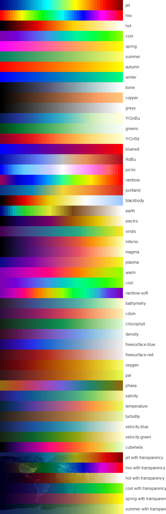

# @waveview/colormap

A utility package to generate colormaps. Rewritten using TypeScript based on the
code from [colormap](https://www.npmjs.com/package/colormap).

## Usage

```ts
import { createColormap } from "@waveview/colormap";

const colors = createColormap({
  colormap: "jet",
  nshades: 10,
  format: "hex",
  alpha: 1,
});
```

## API

`createColormap(spec?: ColorMapSpec)`

Generates a colormap based on the provided specifications.

Color map specification object:

- `colormap` (string | Array): The colormap to use. Can be a string representing a predefined colormap or an array of custom colors.
- `nshades` (number): The number of shades to generate. Default is 72.
- `format` (hex | rgbaString | float): The format of the output colors.
- `alpha` (number | Array): Alpha range, can be a single number or an array with two values for start/end alpha. Default is [1, 1].

## Colormaps



## License

MIT
